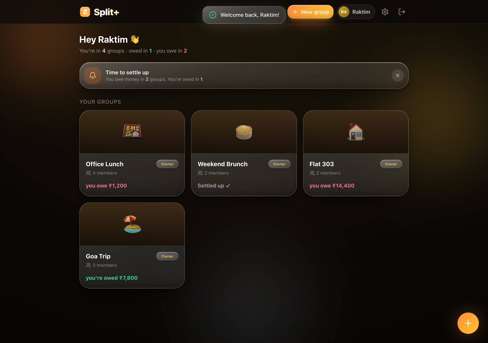

# Split+ 🧾

A glassy, modern **Splitwise-style group expense splitter**. Create groups, split any
bill (equally, by exact amounts, by shares or percentages), attach receipts, settle up
with confirmation, and watch balances flow with animated charts — all wrapped in a warm,
liquid-glass UI.

Split+ is a **React (Vite) single-page app** backed by an **Express API** and **Prisma**,
deployable to **Vercel** as a static SPA + serverless function.



---

## ✨ Features

- **No-email accounts** — your name + passphrase is your login. A one-time **recovery
  code** is shown at sign-up; forget your passphrase and you can recover via the code,
  knowledge-based verification, or an admin-approved reset.
- **Groups with invites** — search a friend by the first 3 letters of their name and
  invite them. Invites stay **pending** until accepted; share invites over **WhatsApp**
  or a copyable link too.
- **Roles** — `owner`, `moderator`, `member`. Owners manage roles and deletion;
  moderators can invite and edit; members participate.
- **Flexible splitting** — equal, exact amounts, shares, or percentages, with correct
  rounding.
- **Receipts, notes & settlements** — attach an image/receipt to an expense; record a
  payment and have the other person **confirm** they received it.
- **Rich charts** — category donut, paid-by bars, balance bars, spending trend, and an
  animated **D3 "money flow"** graph of who owes whom.
- **Per-user settings** — avatar, default currency (no more repeated prompts), and
  in-app **settle-up reminders** (daily / weekly / monthly).
- **Group metrics** — creation date + basic stats for everyone; advanced metrics for
  owners and moderators.
- **Admin panel** — a secret-gated dashboard (`/admin`) with platform-wide metrics
  (users, groups, spend, growth, top categories/spenders/groups, currency & split mix,
  engagement, host/runtime) and an account-recovery approval queue.
- **Delightful details** — shimmer loading states, a themed date picker & confirm
  dialogs, and smooth Framer-Motion transitions.

---

## 🧱 Tech stack

| Layer     | Choice                                                             |
| --------- | ----------------------------------------------------------------- |
| Frontend  | React 18, Vite 6, React Router, Tailwind CSS, Framer Motion, Recharts, D3-force |
| Backend   | Express 4, Zod validation, JWT sessions (`jose`), `bcryptjs`      |
| Database  | Prisma ORM — **PostgreSQL** in production, **SQLite** locally     |
| Tooling   | TypeScript, tsx, concurrently, Playwright (screenshots)          |
| Deploy    | Vercel (SPA + serverless API)                                    |

---

## 🚀 Getting started

### Prerequisites

- Node.js 20+

### 1. Install

```bash
npm install
```

`postinstall` generates the Prisma client against the local SQLite schema, so there's
zero database setup for local development.

### 2. Configure environment

Copy `.env` and set a real secret (local dev works out of the box with the placeholder,
but set your own for anything shared):

```bash
# .env
AUTH_SECRET="a-long-random-value"       # signs session JWTs
# ADMIN_SECRET="separate-admin-secret"  # optional; falls back to AUTH_SECRET
# DATABASE_URL / DIRECT_URL             # PostgreSQL — production (Vercel) only
```

Generate a strong secret:

```bash
node -e "console.log(require('crypto').randomBytes(48).toString('base64url'))"
```

### 3. Create the local database

```bash
npm run db:push:local
```

### 4. Run

```bash
npm run dev
```

- Web (Vite): http://localhost:5173
- API (Express): http://localhost:8787

---

## 📜 Scripts

| Script                 | What it does                                            |
| ---------------------- | ------------------------------------------------------- |
| `npm run dev`          | Runs the Vite web app and Express API together          |
| `npm run build`        | Generates the Prisma client and builds the SPA          |
| `npm run preview`      | Serves the production build locally                      |
| `npm run db:push`      | Pushes the schema to PostgreSQL (`schema.prisma`)       |
| `npm run db:push:local`| Pushes the schema to local SQLite (`schema.sqlite.prisma`) |
| `node scripts/smoke.mjs`     | End-to-end smoke test of the API (auth, groups, roles, recovery, admin, metrics) |
| `node scripts/seed-demo.mjs` | Seeds demo groups/expenses into the local DB      |
| `node scripts/shot.mjs`      | Screenshots the homepage into `docs/homepage.png` |

---

## 🗂️ Project structure

```
split_plus/
├─ src/                 # React SPA
│  ├─ pages/            # AuthPage, HomePage, GroupPage, AdminPage
│  ├─ components/       # UI kit, modals, charts (MoneyFlow), DatePicker, …
│  ├─ state/            # auth + toast contexts
│  └─ lib/              # API client, utils
├─ server/             # Express API
│  ├─ routes/           # auth, groups, expenses, invites, admin, …
│  └─ lib/              # prisma, sessions, recovery, http helpers
├─ shared/             # Pure logic shared by web/server/mobile
│  ├─ validation.ts     # Zod schemas
│  ├─ currency.ts       # currency list + formatting
│  └─ split.ts / balances.ts / types.ts
├─ prisma/
│  ├─ schema.prisma        # PostgreSQL (production)
│  └─ schema.sqlite.prisma # SQLite (local dev)
├─ scripts/            # smoke test, demo seed, screenshot
└─ docs/               # README assets (screenshots)
```

---

## 🔐 Admin panel

Visit **`/admin`** (e.g. http://localhost:5173/admin) and unlock with your
`ADMIN_SECRET` (or `AUTH_SECRET` if none is set). Two tabs:

- **Overview** — platform totals, 7/30-day growth, a 14-day trend, top categories /
  spenders / groups, currency & split-mode mix, engagement, and host/runtime stats.
- **Recovery** — review and approve/reject account-recovery requests, with the user's
  answers shown next to their real account facts for verification.

> The admin secret is never hardcoded — it's read from the environment and compared in
> constant time.

---

## ☁️ Deployment (Vercel)

- The SPA is built by `npm run build`; the Express API is exposed as a serverless
  function via `api/index.ts` and `vercel.json` rewrites.
- Set `DATABASE_URL` (pooled Neon connection with `pgbouncer=true`), `DIRECT_URL`,
  `AUTH_SECRET`, and optionally `ADMIN_SECRET` in Vercel project settings.
- Run `npm run db:push` once against your PostgreSQL instance.

---

## 🖼️ Regenerating the screenshot

With `npm run dev` running:

```bash
node scripts/seed-demo.mjs   # creates the "Raktim" demo account + groups
node scripts/shot.mjs        # writes docs/homepage.png
```

Demo login → **name:** `Raktim`  **passphrase:** `splitplus`

---

## 🧪 Testing

```bash
node scripts/smoke.mjs
```

Spawns the API against a throwaway SQLite DB and exercises the full surface: settings,
invites, roles, stats, all recovery flows, and the admin metrics dashboard.
